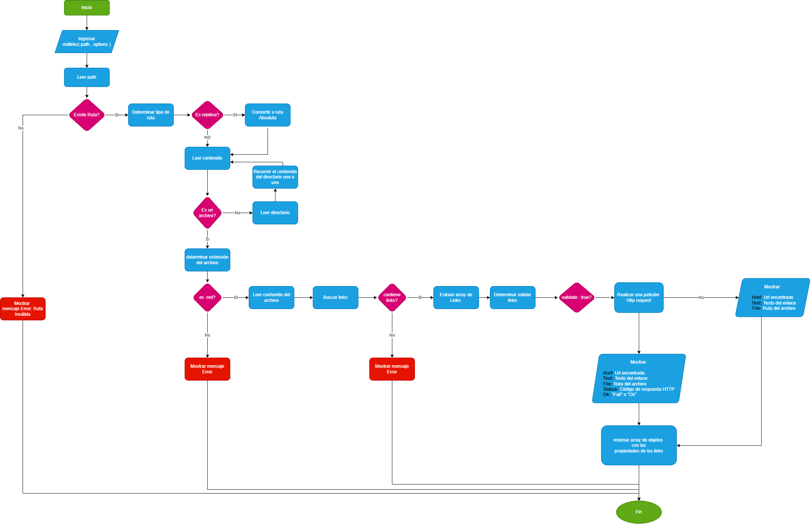

# Markdown Links - Joselyn Danitza

## Índice

* [1. Descripción de la librería](#1-Descripción-de-la-librería)
* [2. Diagrama de flujo](#2-Diagrama-de-flujo)
* [3. Guía de uso](#3-Guía-de-uso)
* [4. Ejemplos de aplicación](#4-Ejemplos-de-aplicación)
* [5. Developer](#5-Developer)

***

## 1. Descripción de la librería
md-links-joselyn-danitza es una librería desarrollada en Javascript y Node.js, permite realizar lecturas de archivos Marckdown para detectar la cantidad de links  y detalle de algunas estadísticas básicas de lo hallado en cada archivo. Detecta a tiempo los enlaces rotos dentro de tu archivo para que puedas eliminarlos, instala está librería y descubre!!

## 2. Diagrama de flujo
El desarrollo de la librería se trabajó de la siguiente manera:

## 3. Guía de uso
Instala la librería colocando el siguiente comando en tu terminal:

## 4. Ejemplos de aplicación

## 5. Developer
### Joselyn Danitza Condori Cabrera

### Archivos del proyecto

* `README.md` con descripción del módulo, instrucciones de instalación/uso,
  documentación del API y ejemplos. Todo lo relevante para que cualquier
  developer que quiera usar tu librería pueda hacerlo sin inconvenientes.
* `index.js`: Desde este archivo debes exportar **una** función (`mdLinks`).
* 

## Este proyecto consta de DOS partes

### 1) JavaScript API

El módulo debe poder **importarse** en otros scripts de Node.js y debe ofrecer la
siguiente interfaz:

#### `mdLinks(path, options)`

##### Argumentos

* `path`: Ruta **absoluta** o **relativa** al **archivo** o **directorio**.
Si la ruta pasada es relativa, debe resolverse como relativa al directorio
desde donde se invoca node - _current working directory_).
* `options`: Un objeto con **únicamente** las siguientes propiedades:
  - `validate`: Booleano que determina si se desea validar los links
    encontrados.
  - `stats`: Booleano que determina si se desea obtener un output
    con información estadística general.

##### Valor de retorno

La función debe **retornar una promesa** (`Promise`) que **resuelva a un arreglo**
(`Array`) de objetos (`Object`), donde cada objeto representa un link y contiene
las siguientes propiedades

Con `validate:false` :

* `href`: URL encontrada.
* `text`: Texto que aparecía dentro del link (`<a>`).
* `file`: Ruta del archivo donde se encontró el link.

Con `validate:true` :

* `href`: URL encontrada.
* `text`: Texto que aparecía dentro del link (`<a>`).
* `file`: Ruta del archivo donde se encontró el link.
* `status`: Código de respuesta HTTP.
* `ok`: Mensaje `fail` en caso de fallo u `ok` en caso de éxito.

#### Ejemplo (resultados como comentarios)