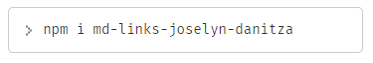

# Markdown Links - Joselyn Danitza

## Índice

* [1. Descripción de la librería](#1-Descripción-de-la-librería)
* [2. Diagrama de flujo](#2-Diagrama-de-flujo)
* [3. Instalar librería](#3-Instalar-librería)
* [4. Ejemplos de aplicación](#4-Ejemplos-de-aplicación)
* [5. Detalle de las propiedades](#5-Detalle-de-las-propiedades)
* [6. Developer](#6-Developer)

***

## 1. Descripción de la librería
`md-links-joselyn-danitza` es una librería desarrollada en Javascript y Node.js, permite realizar lecturas de archivos Marckdown para detectar la cantidad de links  y detalle de algunas estadísticas básicas de lo hallado en cada archivo. Detecta a tiempo los enlaces rotos dentro de tu archivo para que puedas eliminarlos, instala está librería y descubre!!

## 2. Diagrama de flujo
El desarrollo de la librería se trabajó de la siguiente manera:

## 3. Instalar librería
Instala la librería colocando el siguiente comando en tu terminal:

## 4. Ejemplos de aplicación
### Caso 1: solo coloca una ruta
`md-links <path-to-file/directory>`

### Caso 2: Coloca ruta y validate
`md-links <path-to-file/directory> --validate`

### Caso 3: Coloca ruta, validate y stats
`md-links <path-to-file/directory> --validate --stats`

### Caso 4: No coloque ningún argumento
`md-links`

## 5. Detalle de las propiedades
* `href`: URL encontrada.
* `text`: Texto que aparecía dentro del link (`<a>`).
* `file`: Ruta del archivo donde se encontró el link.
* `status`: Código de respuesta HTTP.
* `ok`: Mensaje `fail` en caso de fallo u `ok` en caso de éxito.

## 6. Developer
### Joselyn Danitza Condori Cabrera